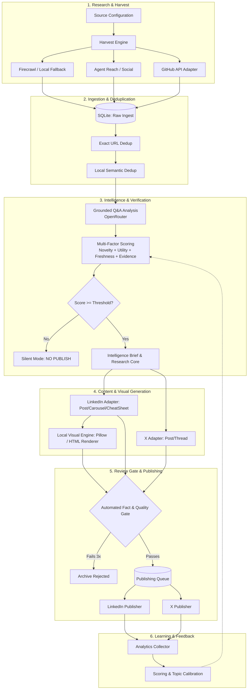
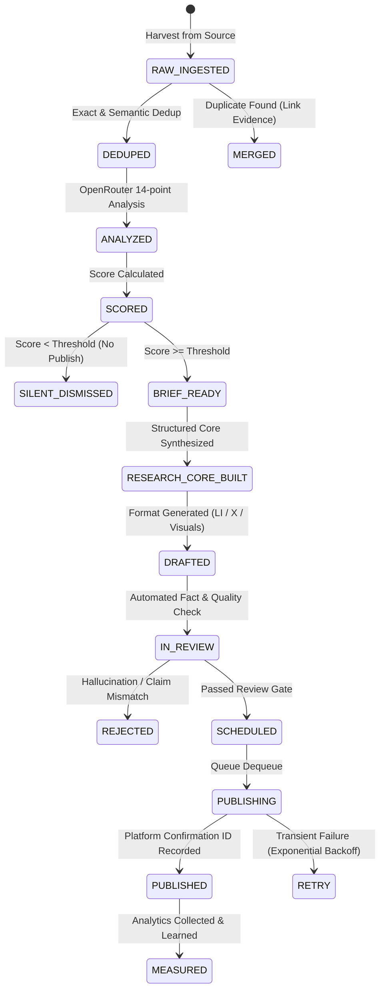

# AI Content Intelligence OS — Architecture Specification

## 1. System Overview & Philosophy

The **AI Content Intelligence OS** is a local-first, autonomous engineering system designed to continuously discover high-signal AI developments (agents, tooling, workflows, real experiments, open-source repositories) and transform verified evidence into high-impact content for LinkedIn and X.

### Core Principles
1. **Signal over Noise:** The primary metric of success is utility and evidence quality. If no discovery meets the threshold, the system enforces **Silent Mode** (`NO PUBLISHABLE INTELLIGENCE`). Silence is strictly preferred over filler.
2. **Local-First & Resilient:** Core execution, storage (SQLite), deduplication, visual rendering, and scheduling run locally on host infrastructure.
3. **Single LLM Gateway:** OpenRouter is the sole external LLM provider for analysis and synthesis. No unapproved third-party AI SaaS dependencies.
4. **Strict Grounding & Review Gate:** Zero tolerance for hallucination or unverified claims. Every factual statement must trace back to primary Tier-1/Tier-2 evidence (repos, commits, docs, reproducible demos).

---

## 2. End-to-End Pipeline



---

## 3. Component Architecture & Modular Layout

To avoid unnecessary microservice overhead while ensuring clean separation of concerns, the system is organized as a unified, modular Python application:

```
intelligence_os/
├── config/                  # Source watchlist, topics, scoring weights, env loader
│   ├── settings.py          # Pydantic-based validated configuration
│   ├── sources.yaml         # Config-driven sources (people, repos, docs, RSS)
│   └── topics.yaml          # Research focus areas and scoring biases
├── core/                    # Core foundation utilities
│   ├── logger.py            # Structured local logging (rotating files + console)
│   ├── exceptions.py        # Typed failure domain exceptions
│   └── events.py            # Lightweight internal event bus / hooks
├── storage/                 # Database and persistence layer
│   ├── db.py                # SQLite connection lifecycle & WAL configuration
│   ├── migrations.py        # Schema versioning and migration manager
│   ├── models.py            # SQLite schema models (Discovery, Content, Queue, Analytics)
│   └── repositories/        # Typed CRUD repositories for each domain
├── research/                # Harvest and discovery adapters
│   ├── harvest_engine.py    # Autonomous polling and normalization coordinator
│   ├── adapters/
│   │   ├── base.py          # Abstract ResearchAdapter interface
│   │   ├── firecrawl.py     # Self-hosted Firecrawl client + local HTTP/BS4 fallback
│   │   ├── agent_reach.py   # Agent Reach integration for public social discovery
│   │   └── github.py        # GitHub API repository, commit, and release tracker
├── dedup/                   # Deduplication and entity linking
│   ├── exact.py             # Canonical URL and content hash deduplicator
│   └── semantic.py          # Local lightweight embeddings & cosine clustering
├── intelligence/            # Analytical reasoning & scoring
│   ├── openrouter.py        # Robust OpenRouter API client (retries, structured output)
│   ├── analyzer.py          # 14-question grounded analysis engine
│   ├── scorer.py            # Configurable multi-factor scoring with freshness decay
│   ├── brief.py             # Intelligence brief aggregator
│   └── research_core.py     # Extraction of Hook, Insight, Evidence, Takeaway, Limits
├── content/                 # Platform content generation
│   ├── linkedin.py          # LinkedIn post, carousel, and cheat-sheet generation
│   └── x.py                 # Standalone post and thread generation
├── visuals/                 # Local visual generation (zero cloud GPU dependency)
│   ├── renderer.py          # Local rendering coordinator
│   ├── carousel_builder.py  # Slide generator using Pillow and local HTML/CSS canvas
│   └── templates/           # Clean, minimalist visual templates
├── review/                  # Review and fact-checking gate
│   ├── checker.py           # Automated hallucination, claim-tracing, and hook reviewer
│   └── verifier.py          # Fact-to-source citation consistency check
├── publishing/              # Queue-driven publishing and retry engine
│   ├── queue.py             # Safe, transactional publishing queue
│   ├── linkedin_publisher.py# LinkedIn platform integration
│   └── x_publisher.py       # X platform integration
├── learning/                # Post-performance collection and optimization
│   ├── collector.py         # Engagement metrics ingestion
│   └── analyzer.py          # Angle & topic performance attribution
├── scheduler/               # Scheduling engine
│   └── runner.py            # Local cron/interval execution loop
└── cli.py                   # Main CLI entry point
```

---

## 4. Data Flow & Entity Lifecycle



---

## 5. Failure Boundaries & Resilience Strategy

| Failure Scenario | Boundary Behavior & Fallback |
| :--- | :--- |
| **Firecrawl container down** | Automatically falls back to local direct HTTP requests + BeautifulSoup/readability parser. Queues heavy JS crawls for later. |
| **Agent Reach / Social API down** | Continues research cycle with GitHub and web sources. Logs warning without halting harvest. |
| **GitHub rate limit / down** | Degrades GitHub adapter; continues non-GitHub discovery without breaking harvest. |
| **OpenRouter rate limit / outage** | Preserves deduped discoveries in SQLite; retries with exponential backoff; never fabricates fake analysis. |
| **Review Gate failure** | Triggers targeted regeneration (max 2 attempts). If claims remain unverified, flags as `REJECTED` and moves to next discovery. |
| **Social API publishing outage** | Item remains safely in `SCHEDULED` queue with retry count. Never deletes unpublished drafts. |
| **Local rendering failure** | Falls back to text-only publication if permissible, or halts asset queue while preserving copy. |
| **Weak intelligence discovered** | Enforces **Silent Mode** (`NO PUBLISHABLE INTELLIGENCE`). System logs reasoning and sleeps until next polling cycle. |

---

## 6. Configuration & Security Strategy

* **Zero Hardcoded Secrets:** All credentials (`OPENROUTER_API_KEY`, `GITHUB_TOKEN`, OAuth tokens) loaded via `.env` or system environment variables.
* **Declarative Sources & Topics:** `sources.yaml` and `topics.yaml` configure people, repositories, feeds, polling intervals, and topic importance weights.
* **Safe SQLite Operations:** Uses Write-Ahead Logging (WAL) and foreign keys for transactional integrity on Windows / OneDrive directories.
